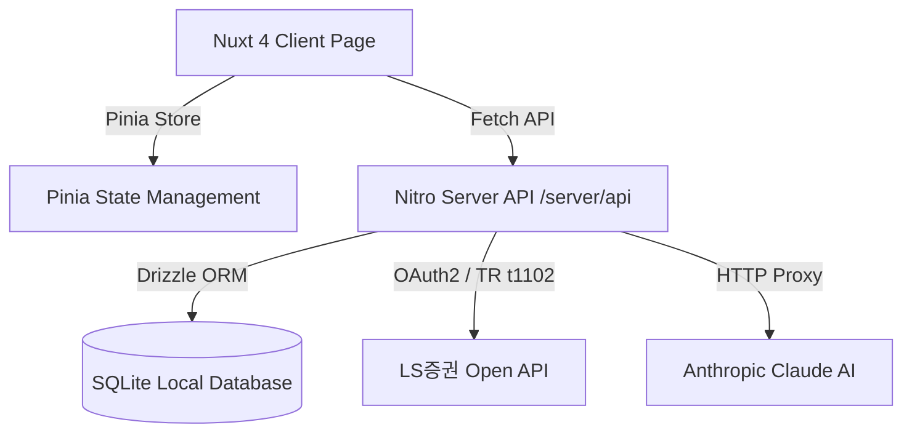

# 🚀 Nuxt 4 기반 주식 포털 마이그레이션 & 매수/매도 알고리즘 고도화 계획서

본 문서는 현재 단일 `index.html` 기반 주식 시스템의 복잡도를 해소하고, **Nuxt 4 + Pinia + SQLite + TailwindCSS** 기반의 현대적인 분산 웹 애플리케이션으로 마이그레이션하며, **정밀 매수/매도 알고리즘**을 추가하기 위한 구조적 아키텍처 기획서입니다.

---

## 📌 1. 현 프로젝트 진단 및 마이그레이션 필요성

### 현재 아키텍처 한계점
1. **단일 HTML 파일 복잡도 증가**: `index.html` 내 1,800줄 이상의 DOM 조작 스크립트, UI 마크업, 이벤트 핸들러가 혼재되어 유지보수 어려움.
2. **독립 프록시 서버 파편화**: `proxy_server.js` (Port 8001)가 static 파일 서버, AI 프록시, LS증권 TR 처리기를 겸하고 있어 백엔드/프론트엔드 경계 불분명.
3. **영속성 데이터베이스 부재**: `watchlist.json`, `watchlist.csv` 등의 단일 파일 의존으로 과거 스크리닝 히스토리 및 정밀 통계 분석 한계.

### 마이그레이션 목표
- **Nuxt 4 풀스택 구조 전환**: 프론트엔드(Vue 3 SSR/SPA)와 백엔드(Nitro API)를 하나로 통합.
- **모듈화 및 컴포넌트화**: 페이지별 역할 분리 및 Pinia 스토어를 통한 체계적 상태 관리.
- **로컬 내장 DB 도입**: SQLite + Drizzle ORM을 통한 시세 데이터 및 시그널 이력 영속화.
- **퀀트 알고리즘 고도화**: 매수타점 6가지 지표 스코어링화 + 정밀 익절/손절/트레일링스탑 알고리즘 탑재.

---

## 🛠️ 2. 추천 기술 스택 (Tech Stack Recommendation)



| 구분 | 추천 기술 스택 | 선택 및 추천 이유 |
| :--- | :--- | :--- |
| **Framework** | **Nuxt 4 (Vue 3)** | Auto Imports, 파일 기반 라우팅, 서버 API(Nitro Engine) 통합으로 별도 Express 서버가 불필요함. |
| **Styling** | **Tailwind CSS v4** | 기존 다크 네온 Cyberpunk 디자인 시스템 완벽 유지, 유틸리티 클래스 기반의 빠른 UI 개발. |
| **State Management** | **Pinia** | Vue 3 전용 반응형 중앙 스토어. 보유종목, 관심종목, AI 진단 상태를 컴포넌트 간 깔끔하게 공유. |
| **Database** | **SQLite + Drizzle ORM** ⭐ *(강력 추천)* | 별도 RDBMS 서버 설치 없이 **단일 `.db` 파일**로 저장. 주식 시세 히스토리, 백테스트, 매매 체결 내역 저기에 가장 가볍고 강력함. TypeScript 기반 Drizzle ORM으로 타입 안전성 보장. |
| **Charts** | **Lightweight Charts / Chart.js** | 실시간 캔들차트, 이동평균선, 볼린저밴드, 거래량 및 지표 시각화. |

---

## 📐 3. 신규 정보 구조 (Information Architecture & Page Routing)

페이지별 역할을 명확히 분리하여 사용성과 가독성을 극대화합니다.

```
[Nuxt 4 App Layout]
├── 🏠 / (Main Dashboard)              : 총자산, 오늘 시장분석, 종합 대응전략, 퀵 매수타점 현황
├── 🔍 /screener (Stock Screener)      : 유망업종 6대 지표 스크리너, OLD vs NEW 실시간 비교, 업종 히트맵
├── 💼 /portfolio (Holdings)           : 보유종목 상세 현황, 평단가/수량/손익률, AI 종목 진단
├── 📊 /reports (AI Reports Archive)   : 일자별 AI 종합 분석 리포트 아카이브 및 Markdown/PDF 내보내기
└── ⚙️ /settings (System Settings)     : LS증권 API Key, Anthropic AI Key, 알고리즘 임계값 설정
```

### 📄 페이지별 세부 구성

#### 1. `pages/index.vue` (메인 대시보드)
- **상단 요약 카드**: 총 매수금액, 평가 금액, 누적 평가손익, 실시간 수익률(%), 당일 시장 종목 수.
- **오늘의 시장 분석 & 대응 전략**: 최신 AI 시장 종합 분석 보고서 핵심 요약 표출.
- **실시간 포착 요약 브리핑**: 스크리너 6대 조건 100% 충족된 **[🎯 매수 강추 종목 TOP 3]** 하이라이트.

#### 2. `pages/screener.vue` (유망업종 & 기술적 관심종목 발굴)
- **이전 분석(OLD) vs 실시간(NEW) 비교 뷰**: 상단 이전 기록, 하단 실시간 갱신 레이아웃.
- **6가지 기술적 지표 필터링 컨트롤러**: 심리선(PSY), 볼린저밴드, 이평선, MACD, RSI, 거래량 조절 슬라이더.
- **업종별 맵 (Industry Heatmap)**: 전기전자, IT/반도체, 바이오, AI 등 업종별 수급 집중도 시각화.

#### 3. `pages/portfolio.vue` (보유 종목 상세 관리)
- **보유 종목 카드/테이블**: 보유수량 $\times$ 평균단가 = 매수금액 실시간 자동 계산.
- **AI 매수/매도 진단 모달**: 종목별 `[AI 매수/매도 진단]` 클릭 시 차트 스냅샷과 함께 정밀 리포트 팝업.

---

## 📊 4. DB 스키마 설계 (SQLite + Drizzle ORM)

### `schema.ts` 예시
```typescript
import { sqliteTable, text, integer, real } from 'drizzle-orm/sqlite-core';

// 1. 보유 종목 테이블 (Holdings)
export const holdings = sqliteTable('holdings', {
  id: integer('id').primaryKey({ autoIncrement: true }),
  shcode: text('shcode').notNull().unique(),
  name: text('name').notNull(),
  industry: text('industry'),
  quantity: integer('quantity').notNull(),
  avgPrice: real('avg_price').notNull(),
  currentPrice: real('current_price'),
  updatedAt: text('updated_at').notNull()
});

// 2. 스크리너 타깃 종목 및 히스토리 테이블 (Screener History)
export const screenerHistory = sqliteTable('screener_history', {
  id: integer('id').primaryKey({ autoIncrement: true }),
  batchId: text('batch_id').notNull(), // 예: 2026-08-11_130000
  shcode: text('shcode').notNull(),
  name: text('name').notNull(),
  industry: text('industry').notNull(),
  closePrice: real('close_price').notNull(),
  psy: real('psy').notNull(),
  bbLower: real('bb_lower').notNull(),
  volumeRatio: real('volume_ratio').notNull(),
  macdHist: real('macd_hist').notNull(),
  rsi: real('rsi').notNull(),
  score: integer('score').notNull(), // 퀀트 점수 (0 ~ 100)
  isFullyMatched: integer('is_fully_matched', { mode: 'boolean' }).notNull(),
  createdAt: text('created_at').notNull()
});
```

---

## 🎯 5. 매수/매도 정밀 알고리즘 설계

기존 6가지 조건 판별 방식을 넘어, **정량적 퀀트 점수(Quant Score)** 및 **다이내믹 매도 알고리즘(Dynamic Exit Strategy)**을 도입합니다.

### A. 정밀 매수 알고리즘 (Buy Signal Engine - 100점 만점)

$$Score = S_{PSY} + S_{BB} + S_{MA} + S_{VOL} + S_{MACD} + S_{RSI}$$

| 번호 | 기술적 평가 지표 | 조건 및 가중치 점수 | 판단 로직 |
| :---: | :--- | :--- | :--- |
| **1** | **심리선 (PSY 12일)** | 15점 | 12일간 상승일 비율 $\le 25\%$ (과매도 극단 구간) |
| **2** | **볼린저 밴드 지지** | 15점 | 현재가가 볼린저 20일(2SD) 하단 밴드의 $102\%$ 이내 수렴 |
| **3** | **이평선 정배열 전환** | 20점 | 단기 이평선 정배열 전환 ($MA_5 \ge MA_{20} \ge MA_{60}$) |
| **4** | **거래량 수급 급증** | 20점 | 당일 거래량 비율 전일 대비 $\ge 120\%$ (수급 유입) |
| **5** | **MACD 반전/다이버전스** | 15점 | MACD 오실레이터 $> 0$ 양전 및 상승 다이버전스 발생 |
| **6** | **RSI 과매도 탈출** | 15점 | RSI(14) $30$ 이하 탈출 반등 (상승 전환 시그널) |

- **시그널 등급**:
  - **85점 이상**: `🎯 [매수 강추 (Strong Buy)]`
  - **70 ~ 84점**: `👀 [관심 분할매수 (Buy Interest)]`
  - **70점 미만**: `⏳ [관망 (Hold/Watch)]`

---

### B. 정밀 매도 알고리즘 (Sell Signal Engine)

주식 매매에서 가장 중요한 **익절(Take Profit), 손절(Stop Loss), 트레일링 스탑(Trailing Stop)** 3중 방어막을 탑재합니다.

```mermaid
flowchart TD
    PriceCheck[현재가 모니터링] --> StopLossCheck{매수가 대비 -4.5% 이하?}
    StopLossCheck -- Yes --> Cut[🚨 즉시 손절 (Stop Loss)]
    StopLossCheck -- No --> TrailingCheck{최고가 대비 -3.0% 하락?}
    TrailingCheck -- Yes --> ProtectProfit[🛡️ 이익보존 매도 (Trailing Stop)]
    TrailingCheck -- No --> TargetCheck{목표가 1차/2차 달성?}
    TargetCheck -- Yes --> ProfitTake[💰 단계별 분할 익절 (Take Profit)]
    TargetCheck -- No --> TechExit{볼린저 상단 + RSI > 70?}
    TechExit -- Yes --> OverboughtExit[⚠️ 과매수 탈출 매도]
    TechExit -- No --> Hold[전략 유지 (Hold)]
```

#### 1. 🚨 기계적 손절 (Stop Loss)
- **조건**: 매수가 대비 **`-4.5%`** 하락 시 감정 없이 100% 매도.
- **목적**: 대형 하락장 및 악재 시 계좌 파산 방지.

#### 2. 🛡️ 추적 손절매 (Trailing Stop)
- **조건**: 매수 후 수익 발생 시, **달성한 최고가(High Peak) 대비 `-3.0%` 하락 시** 자동 매도.
- **목적**: 수익이 났던 종목이 다시 손실로 돌아서는 것을 방지하고 이익을 최대화함.

#### 3. 💰 단계별 목표가 익절 (Take Profit - RRR 1:2)
- **1차 익절 (+5.0% ~ +8.0% 달성 시)**: 보유 수량의 `50%` 매도하여 확정 수익 실현.
- **2차 익절 (볼린저 상단 밴드 터치 + RSI > 70 과매수 진입 시)**: 잔여 수량 `50%` 최종 익절.

#### 4. ⚠️ 기술적 지표 이탈 매도 (Technical Exit)
- **이평선 이탈**: 거래량이 실린 음봉으로 20일 이동평균선 이탈 시 매도 시그널 발생.

---

## 🗺️ 6. 마이그레이션 단계별 실행 로드맵 (Roadmap)

| 단계 | 작업 내용 | 세부 출력 결과물 |
| :--- | :--- | :--- |
| **Phase 1** | **Nuxt 4 프로젝트 생성** | `npx create-nuxt-app`, TailwindCSS v4, Pinia, Drizzle ORM 패키지 설치 |
| **Phase 2** | **SQLite DB 및 API 서버 구축** | `server/api/screener.post.ts`, `server/api/ai.post.ts` Nitro 핸들러 이전 |
| **Phase 3** | **Pinia 스토어 및 UI 컴포넌트화** | `useScreenerStore`, `usePortfolioStore` 구현 및 대시보드 컴포넌트 분리 |
| **Phase 4** | **정밀 매수/매도 알고리즘 구현** | 100점 퀀트 스코어링 모듈 및 익절/손절/트레일링스탑 엔진 탑재 |
| **Phase 5** | **통합 테스트 및 데이터 마이그레이션**| 기존 `watchlist.json` ➔ SQLite DB 이전 및 동작 검증 |

---

## 💬 요약 및 의견

현재 작성된 `index.html` 중심 구조에서 **Nuxt 4 + Pinia + SQLite** 환경으로 전환하면:
1. 복잡했던 코드가 깔끔한 Vue 컴포넌트와 API 파일로 분리되어 **유지보수가 10배 이상 쉬워집니다.**
2. **SQLite DB**를 사용하므로 과거 기술적 지표 분석 기록과 AI 보고서가 완벽히 보존됩니다.
3. 새롭게 추가되는 **정밀 매수(100점 스코어링) 및 매도(익절/손절/트레일링스탑) 알고리즘**을 통해 감정에 휘둘리지 않는 규칙 기반 주식 투자 포털 구축이 가능해집니다.

위 계획서 검토 후, 진행을 원하시는 단계(예: Nuxt 4 프로젝트 기본 뼈대 생성 및 DB 스키마 작성 등)부터 단계별로 차근차근 진행할 수 있습니다.
